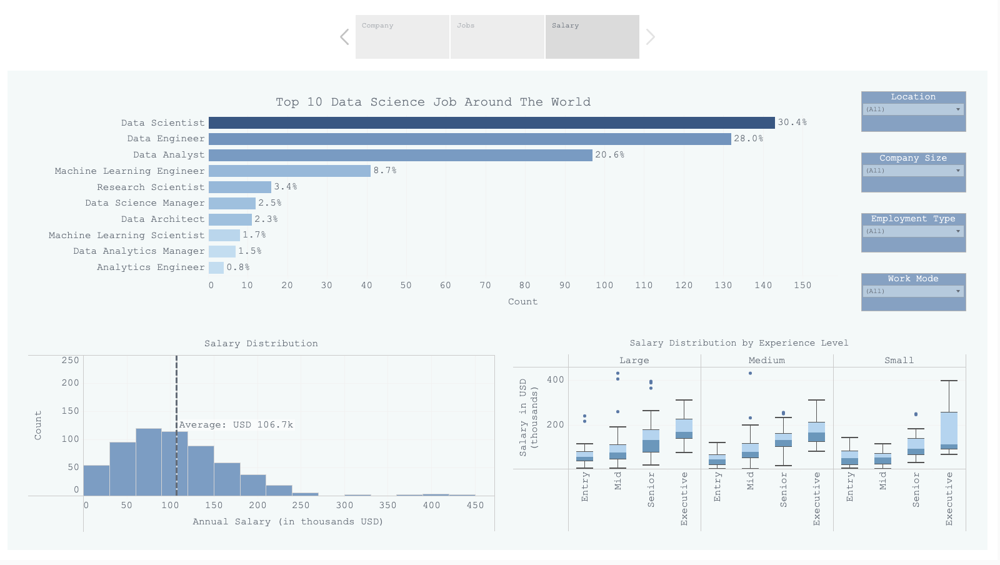

# Data Science Jobs Around the Globe 🌍

## Background
I was curious to see how the different data science related roles are distributed across the globe. With the dataset I obtained from Kaggle, I built a dashboard to show the distribution of data science related roles across the globe, where do companies who hire these data science people come from and how the salary are broken down by various factors (location, employment type, seniority level, and working mode). Hopefully, this will provide me and similar individuals who are learning data science a better understanding of data science employment across the globe. 

## Objective 
+ Apply data preprocessing and exploratory data analysis to raw dataset 
+ Apply data visualizations skills to design user friendly dashboard 
+ Apply analytical thinking to determine analysis method and summarize meaningful insights 

## Dataset  
Data Science Fields Salary Categorization Dataset contains a total of 607 data points taken from 2020-2022 with 9 columns 

## Findings 
Findings can be found in the PDF document in this github page. 

## Tools 
+ Google Sheets, Google Docs, Tableau 

## Resources 
+ [Kaggle Dataset](https://www.kaggle.com/datasets/whenamancodes/data-science-fields-salary-categorization)

## Demonstration 
+ [Tableau Dashboard](https://public.tableau.com/views/DataScienceJobsAroundTheWorld/StoryFinal?:language=en-US&publish=yes&:display_count=n&:origin=viz_share_link)

## Authors
+ [@jovitakurniawan](https://www.github.com/jovitakurniawan)

Copyright 2022 © Jovita kurniawan 
